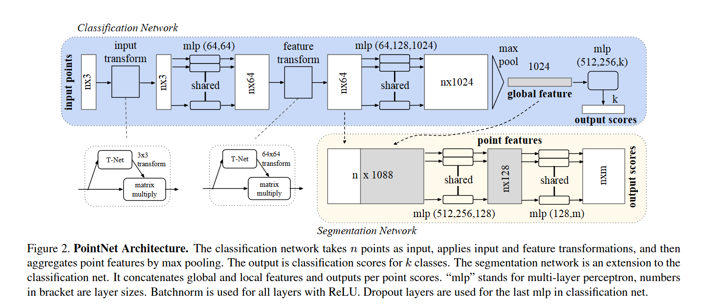

# 基于深度学习的点云目标检测算法实现

> 本任务旨在实现一个基于神经网络的三维点云目标检测系统，要求能够对原始或预处理后的三维点云数据进行目标识别与检测，输出目标的类别及其三维包围框信息。

任务目标：

1. 数据准备与预处理

   - 1.1 熟悉并解析点云数据格式（如 `.bin`、`.pcd`、`.ply` 等）；
   - 1.2 实现点云数据的归一化、裁剪、投影、采样等预处理操作；
   - 1.3 数据集划分合理，标注信息可用于训练监督。
2. 模型设计与训练：

    - 2.1 构建或改进点云目标检测网络；
    - 2.2 实现数据加载模块、网络前向传播、损失函数与训练过程
    - 2.3 模型需能输出目标类别与其三维边界框（center + size + orientation）。

3. 模型评估与测试：

    - 在测试集上进行模型性能评估；
    - 可视化检测结果（支持显示检测框与真实框对比）；
    - 评估指标包括但不限于：3D mAP（Mean Average Precision）、IoU、Precision、Recall 等。

4. 结果可视化与模型管理：

    - 支持训练过程中的损失曲线、mAP 曲线可视化；
    - 支持保存和加载训练权重；
    - 支持调用模型进行测试推理并输出结果。

对此，我们选择了数据集NuScenes, 并且采取开源的代码项目:`IS-Fusion`，来完成这个目标。由于数据集过大（300GB+），我们最终选择的是`NuScenes-mini`数据集(3GB+).

## 1. 查看方法

我们得知，`IS-Fusion`是CVPR'2024 论文，论文地址是`https://openaccess.thecvf.com/content/CVPR2024/papers/Yin_IS-Fusion_Instance-Scene_Collaborative_Fusion_for_Multimodal_3D_Object_Detection_CVPR_2024_paper.pdf`。该工作同时对实例级和场景级多模态上下文进行建模，以增强 3D 检测性能。我们可以查看对应的论文，了解其原理、方法和贡献，并且针对性地分析其问题所在。下面是我们读完论文的理解和感受。

### 1.1 3D目标检测的挑战

3D目标检测是自动驾驶、机器人和增强现实等领域的关键技术，其核心在于精确感知和理解三维空间。激光雷达（LiDAR）传感器通过发射激光束并测量其反射时间，能够生成环境的精确三维点云数据，为3D感知提供了关键的几何信息 。然而，原始点云数据本身带来了独特的、根本性的挑战，使得传统的计算机视觉技术（如在图像上大获成功的卷积神经网络，CNN）难以直接应用。

这些挑战主要源于点云的特征：

- 无序性：点云是点的集合，其数据记录的顺序与物体的几何形状无关。因此，处理点云的模型必须具备排列不变性，能够从无序的点集中学习到一致的特征 。
- 稀疏性：LiDAR采集的点云在三维空间中分布极不均匀且高度稀疏。绝大部分三维空间是空的，没有任何数据点 。若将整个空间划分为规则的网格（体素），超过90%的体素将是空的 。直接在这样的稀疏数据上应用密集卷积操作，会造成巨大的计算和内存资源浪费 。
- 不规则性：点云的密度随距离和物体表面材质的变化而变化。近处的物体点云密集，远处的物体则非常稀疏。这种不规则的采样密度给学习统一且鲁棒的特征表示带来了巨大困难 。

我们经过调研发现，对于以上的挑战，早期的解决方案大多依赖于人工设计的特征提取方法，例如将点云投影到鸟瞰图（Bird's-Eye View, BEV）或前视图，然后应用2D图像处理技术，或者将点云栅格化为三维体素并编码手工设计的特征 。但是投影或手工特征提取过程不可避免地会丢失原始点云中丰富的几何信息，限制了模型的最终性能 。所以我们开始探索能够直接从原始点云中学习特征的端到端方法，从而催生了两大主流技术路线：基于点的方法和基于体素的方法。

### 1.2 基于点的方法

这个方法是从2017年就有了比较前沿的突破：PointNet。这个的核心思想是为每个点独立地学习一个空间编码，然后通过一个对称函数（具体为最大池化操作）将所有点的特征聚合为一个全局特征向量，从而实现对输入点云排列的置换不变性 。

也就是说，pointnet对点云的无序性的处理，是十分巧妙的。此外，它还摒弃了任何形式的体素化或投影，直接从原始点云中提取特征，标志着3D深度学习从依赖手工特征向端到端学习的重大转变。



但是我们也知道，PointNet的一个根本性局限在于它孤立地处理每个点，并通过全局池化丢失了局部结构信息。这就意味着，它无法捕捉局部几何结构，在精细模式识别以及复杂场景中的表现不佳。

所以，为了克服这个难题，我们看到了其迭代：`Pointnet++`:它的核心贡献在于引入了一个分层的神经网络架构，能够以类似于CNN的方式，在不断增大的感受野中学习局部特征。所以我们就可以通过递归地在输入点集的嵌套分区上应用PointNet来捕捉局部到全局的结构信息 。这里的每一个层级，包括之前的pointnet层，还有额外的采样层以及分组层，方便我们找到局部的特征，然后最后聚合为整个物体或场景的高阶语义特征。


除此之外，我们的pointnet++还引入了两种密度自适应的策略：多尺度分组和多分辨率分组。多尺度分组对局部区域进行分组、特征提取，并且拼接不同尺度的特征信息。而多分辨率分组啧是结合了上一层抽象后的特征和当前层原始点的特征，以一种更高效的方式融合多分辨率信息 。这两个策略，十分有效地提升了处理点云中的，密度不均的问题。

### 1.3 基于体素的方法

与直接处理无序点集的方法不通，我们有一些方法是将不规则的点云转换为规则的三维网格（即体素），从而能够利用成熟且强大的3D卷积神经网络进行特征提取。这个就和我们的2d的目标检测方法就可以连上了。

例如，`VoxelNet`，它将点云转换为三维体素，然后通过3D卷积网络提取体素特征，最后通过RPN生成候选框。其包括`体素划分`，`点分组与采样`，`特征增强与编码`,`局部聚合`,`特征拼接与输出`几个部分，然后进行`FCN和最大池化操作`，并且最终通过RPN和NMS处理，得到了检测结果。完全就和我们的2d的目标检测方法是一样的流程。可惜的是，这个的效率并不是很高。不过这给我们带来了十分多的思路和思考。


所以，我们后面为了去节省计算的资源，提升计算的效率，大多数人就去做了稀疏性相关的改进。因为这个是非常可以节省我们的计算资源的。研究者们得到了一个`SECOND`的方法，主要是通过"稀疏卷积"的思想，只在非空体素上进行卷积计算（通过一种高效的数据结构和算法来管理非空体素的位置，并在卷积过程中只对这些活动位点及其邻域内的其他活动位点进行特征的收集和计算，完全跳过了对海量空体素的无效操作 ）。


幸运的是，这个方法，使得我们的速度大幅提升，也让我们了解到了，基于体素的方法有那么大的潜力，使得之后的复杂的3D网络成为可能。

### 1.4 检测方法进一步发展

由于基于点的方法和基于体素的方法 都有了很大的突破，我们就得到了一些综合的方法， 或者引入了其他方式的方法。

例如，pointRCNN，这个就是一个两阶段的检测方法：（1）第一阶段以自下而上的方式直接处理原始点云，通过点云分割将场景分为前景和背景，从而生成少量高质量的3D候选框。


（2）系统会将每个候选框内的点转换到标准坐标系（canonical coordinates）中以学习局部空间特征。最后，结合第一阶段学习到的全局语义特征，对候选框的位置、大小和类别进行精确的优化和预测，得出最终的检测结果。这个和我们之前的认知都是一样的。

随后，我们的3D目标检测，进入了多模态融合的路。

### 1.5 多模态融合/BEV

随着基于LiDAR的3D目标检测技术日趋成熟，我们可以有这个意识：单一的传感器，不会让我们的方法更加鲁棒性。只有融合了多模态的信息，我们才可以得到全面的、稳健的对世界的感知和认识。在此过程中，鸟瞰图（BEV）作为一种理想的中间表示，逐渐成为多模态融合的"通用语言"。

摄像头和LiDAR这两种自动驾驶中最核心的传感器，一个提供精准的几何特征，一个提供丰富的语义信息。这两个一结合，我们就可以构建出来对世界的一个比较精准的感知了。大家都知道这样做是好的，目前的挑战和问题就是，如何有效地对齐和融合这两种来源和表示空间完全不同的异构数据。

根据融合发生在网络架构中的阶段，大致可以分为早期融合、晚期融合和深度/中间融合。

- 早期融合：数据级融合，输入层面对原始数据或低级特征进行融合（如点云上色），能够让网络从一开始就学习跨模态的联合表示。但是问题是，对传感器之间的标定精度极为敏感，任何微小的标定误差都可能导致特征错位，引入噪声。同时，过早的融合，会容易丢失一个模态的特征，系统性能会急剧下降。

- 晚期融合：决策级融合，它让每个模态的数据通过独立的网络进行处理，直到最后生成各自的检测结果（如边界框），然后再对这些高层级的输出进行融合 。他的特点就是，架构模块化，易于实现和扩展。由于各分支独立，当某一传感器失效时，其他分支仍能正常工作，系统鲁棒性高。也就相当于同时进行了两个预测工作。但是缺点就是，完全放弃了在特征层面进行跨模态交互的机会，无法学习到模态间深层次、细粒度的关联信息，因此性能上限通常不高 。

- 深度/中间融合：目前性能最优的特征融合，使用各自独立的骨干网络从不同模态中提取特征，然后在网络的中间某个特征层面对这些特征图进行融合 。这种方法兼顾了两种极端策略的优点，既允许网络学习各模态的独立高级表示，又能在特征空间中进行丰富的跨模态信息交互。

我们来看例子。这里的BEVFusion，就是一种深度/中间融合的方法。这是一个里程碑的工作。主要因为BEV的以下特点：

（1）BEV提供了一个与自车相关的、俯瞰视角的2D网格表示。来自不同位置、不同朝向的多个摄像头以及LiDAR的特征，都可以通过坐标变换被投影到这个统一的BEV空间中，从而解决了多传感器视角对齐的难题 ；（2）BEV能够很好地同时保留LiDAR的几何结构信息（如物体的形状和相对位置）和来自图像的语义信息（通过视角转换赋予BEV网格语义特征）；（3）在摄像头的透视视图中，物体的大小会随着距离变化而变化（近大远小），且容易发生遮挡。而鸟瞰图不会，体在BEV空间中的尺寸和空间关系是固定的，这极大地简化了检测任务 ；（4）BEV是进行路径规划和运动控制等下游任务的自然表示，使得感知与决策规划模块可以无缝衔接。

由此，我们开始分析BEVFusion的架构。这也是我们的IS-Fusion的基准和对标。


上面是两个不同机构提出的BEVFusion的架构。但是他们核心思想都是一样的：将摄像头的图像特征和激光雷达的点云特征转换到同一个上帝视角的二维网格（BEV）中，是进行有效融合的最佳方式。而且流程都是：

1. 分别处理摄像头和激光雷达的输入，提取各自的特征，进行独立的编码;
2. 将多视角的摄像头图像特征通过视图转换模块（如LSS）投影到BEV空间，形成Camera BEV特征图。同时，也将点云处理成LiDAR BEV特征图。
3. 在BEV空间下，对来自不同传感器的特征图进行融合。
4. 将融合后的BEV特征输入到下游任务（如3D物体检测、路面分割）的解码器中，输出最终结果。

二者的区别也主要是在于多任务平台，另一个注重鲁棒性。

所以我们可以看到，BEVFusion是一个清晰的、大众的、通用的架构。主要的结构就两个：

（1） 独立的模态流，通过这个模态流，生成摄像头和LiDAR的BEV特征图；
（2） 共享BEV空间融合：简单的拼接，之后通过一个卷积层来整合信息并降低通道数。

上面就是我们的BEVFusion的核心思想。也是我们今天说的IS-Fusion的启蒙思想。

我们发现，尽管BEVFusion已经很完备了，但是其挑战就凸显了出来：融合，是场景不可知的，也就是网络必须在融合后的大量背景信息噪声中，自行学习去发现微弱的物体信号。所以我们今天研究的IS-Fusion就产生了，主要就是在思考，如果我们先融合整个场景，然后利用场景中的物体实例本身，去引导一次更具针对性的二次融合，效果会不会更好？

### 1.6 IS-Fusion

与上面的BEVFusion不同，IS-Fusion的核心论点是：现有主流的多模态融合方法，特别是那些完全依赖于在BEV空间进行场景级特征融合的模型，在融合过程中忽略了前景实例（如车辆、行人）与背景区域（如道路、建筑）之间的内在差异，这会稀释掉小物体的特征信号，不利于我们各种任务的鲁棒性。

故此，IS-Fusion的目标是设计一个能够显式地引入实例级多模态信息，并促进实例级特征与场景级特征之间协同工作的全新框架 。其最终目的是生成一个"实例感知"（instance-aware）的BEV表示，使得每个位置的特征都能够根据场景中的关键物体进行动态调整和增强。


我们来仔细分析其结构。我们可以看到，它的整体架构遵循一个清晰的流水线：

- 首先，通过模态特定的编码器提取初始特征；
- 然后，这些特征被送入其核心的两个模块：分层场景融合（Hierarchical Scene Fusion）和实例引导融合（Instance-Guided Fusion），最后由一个检测头输出最终结果。

所以我们就知晓了，其中最重要的就是这两个模块：

#### 1.6.1 分层场景融合 HSF

HSF旨在从不同粒度（点、网格、区域）上捕捉和融合多模态的场景上下文信息，从而生成一个信息丰富的初始BEV特征图 。他是通过一个两阶段的Transformer来完成这一任务的。

1. 点到网络Transformer：将点级别的特征聚合到BEV网格级别。首先就是将BEV柱内的LiDAR点投影到图像特征图上，以获取对应的像素级语义特征。这就完成了一次融合。为了应对LiDAR和相机之间可能存在的标定噪声，它在每个柱内部的所有点之间进行注意力计算，允许每个点"看到"一个更大的感受野，从而隐式地校正噪声点的影响。通过最大池化操作整合柱内的多模态信息，生成网格级别的BEV特征。


2. 网格到区域Transformer：旨在捕捉全局场景上下文。我们得到了网格特征之后，在所有网格特征上应用全局自注意力会带来巨大的计算开销。所以我们就将BEV网格分组为不同的区域，在每个区域内部通过注意力机制交换网格间的信息，并且通过移位操作，并在移位后的区域上再次进行自注意力计算。

通过上面两个transformer的方式，我们就实现了将信息从单个点传播到整个BEV区域，整合了局部和全局的多模态场景上下文。

#### 1.6.2 实例引导融合 IGF

IGF模块是IS-Fusion架构中最核心的创新，它实现了从"场景融合"到"实例引导场景融合"的范式转变。基本思想是挖掘每个物体实例周围的多模态上下文，并将这些关键的实例级信息整合回场景特征中，从而生成一个"实例感知"的BEV表示 。主要有三个步骤：


1. 实例候选选择：目标是从场景中高效地找出潜在的物体，它在HSF模块输出的场景特征图上应用一个关键点检测头，来预测每个网格的"中心度"（centerness），即该点成为物体中心的概率。在推理时，选取中心度得分最高的Top-K个点作为实例候选，并通过一个线性层将它们嵌入为实例查询

2. 实例上下文聚合：旨在丰富每个实例查询的特征表示。它包含两个方面的交互：首先，通过在所有实例查询之间进行自注意力（self-attention），来探索实例与实例之间的关系；其次，为了挖掘每个实例的局部上下文，它使用可变形注意力让每个实例查询去高效地从多模态特征图中采样并聚合其周围邻域的特征。使得获得的上下文比较精确稳健。

3. 实例到场景Transformer：这是实现协同融合的决定性步骤。它采用了一个交叉注意力机制，其中，全局BEV特征图中的每个网格特征充当查询q,而经过上一步骤丰富后的实例级特征则充当键k和值v，这个设计允许场景中的每一个位置都能主动地从场景中所有相关的、重要的物体实例中"拉取"信息。

#### 1.6.3 HSF和IGF融合

HSF和IGF两个模块之间的协同工作和创新的信息流，是我们的巧妙所在。

- HSF模块首先从底层传感器数据出发，以一种自下而上的方式（点 -> 网格 -> 区域），构建出一个全面但通用的（generic）全场景BEV表示。

- IGF模块则接收这个场景图，并以一种自顶向下的方式，首先识别出场景中的关键"角色"（即物体实例）。然后，它通过上下文聚合来丰富这些"角色"的特征。

- 最关键的一步是IGF将信息反馈给场景表示。经过丰富后的实例特征并不仅仅用于一个独立的预测分支，而是被用来引导和精炼由HSF生成的初始场景图。这最终产生了一个实例感知的BEV表示，其中背景区域的特征已经被其周围的前景物体所"上下文关联"和增强。

这种架构设计实现了从被动集成到主动引导的范式转变。BEVFusion等模型采用的是被动融合，如同将两张透明的地图（一张几何图，一张语义图）叠在一起，网络必须自己从重叠的像素中去分辨哪些信息是重要的。而IS-Fusion的IGF模块则像一个智能向导，先在地图上标出所有的预测点，然后让地图上的每一个位置都能参考这些点来更新自己的信息。

所以，我们最后得到，这一机制大大优化了前景-背景模糊性的问题。在最终的BEV图中，每个实例所在位置的特征表示由其自身丰富的特征所主导，而不是背景，从而为后续的检测头提供了更强、更清晰的信号。这表明，该领域正在从基于密集网格的、穷举式的预测，转向更稀疏、更高效的、将计算资源集中在场景最相关部分的查询机制。

我们在不同的论文里面找到了对比数据，并总结得到模型之间的对比：


我们可以看到，IS-Fusion的功能在目前是非常强的。

下面我们来复现`IS-Fusion`，并且分析其代码部分。

## 2. 流程展示

我们从这里开始，进行`IS-Fusion`的实验配置部分。包括环境配置、数据集准备、模型训练、模型评估、结果可视化等。我们会分析方法的实验过程，运行过程，从而建立起对方法的优缺点的评价。之后，就可以针对其中的问题提出必要的改进。

### 2.1 环境配置

我们的`IS-Fusion`是基于`PyTorch`的大框架的，基于 torch 1.10.1、mmdet 2.14.0、mmcv 1.4.0 和 mmdet3d 0.16.0。所以第一步是创建环境并且安装对应的包文件。

```bash
conda create -n isfusion python=3.7
conda activate isfusion
conda install pytorch==1.10.1 torchvision==0.11.2 torchaudio==0.10.1 -c pytorch
```

由于MMDetection3D 依赖于 MMDetection，因此 mmcv-full 是必需的。mmcv有其自己的安装工具:mim。我们可以通过这个安装。mim 是 OpenMMLab 项目的包管理工具。

```bash
pip install -U openmim
mim install mmcv
```

这里mim会直接选择最合适我们的mmcv-full版本。除此之外，我们也可以按照对应的cuda版本以及pytorch版本来选择其他的mmcv-full版本。

接下来就是mmdetection和MMSegmentation，也是我们的基础。

```bash
pip install mmdet==2.14.0
pip install mmsegmentation==0.14.1
```

下面是最重要的一部分，也就是安装mmdetection3d.这个使我们可以对点云等数据进行处理。这个是在Github的发布，所以我们需要下载源代码并且通过setup来进行安装。

```bash
git clone https://github.com/open-mmlab/mmdetection3d.git
cd mmdetection3d
pip install -v -e .
```

最后需要安装torchEX,这个是在`mmdet3d/ops/TorchEx`目录下。

```bash
cd mmdet3d/ops/TorchEx
pip install -v -e .
```

完成以上的安装，我们再使用pip安装一些基础的库，在`ISFusion/requirements.txt`中。一般来说，完成上面的步骤，就可以全部安装完这里面的包了。

```bash
pip install -r requirements.txt
```

最后，我们可以通过pip freeze > new_requirements.txt来保存我们的包，或者通过`conda env export > environment.yaml`来保存我们的环境文件，便于之后进行复现。其实原仓库里面， 已经有了docker的配置文件，我们可以直接在另一台机器中使用docker复现这个场景。

### 2.2 数据集准备

完成了环境的配置，就可以开始进行数据集的配置了。我们按照官网的配置，链接了我们的数据集：由于我们准备的是nuscenes-mini数据集，但是要求要放在`mmdetection3d/data/nuscenes`目录下。所以我们创建软链接：

```bash
ln -s /home/lishengjie/data/nuscenes-mini /home/lishengjie/study/jiahao/bupt_2507/ISFusion/data/nuscenes
```

然后对数据集进行配置：

```bash
python tools/create_data.py nuscenes --root-path ./data/nuscenes --out-dir ./data/nuscenes --extra-tag nuscenes --version v1.0-mini
```

我们可以观察到，这里的

### 2.3 模型训练

我们可以看到，在`tools/train.py`中，有对应的训练代码。然后我们可以调用`tools/run-nus.sh`，来针对性地对这个nuscenes数据集进行处理，并且开始训练的过程。\

```bash
bash tools/run-nus.sh 'tag'
```

后面设置'tag'，方便我们查看log以及训练数据等。

我们可以看到，这个sh文件主要是加载一些参数，然后调用`tools/train.py`来开始训练。


里面我们设置了python第三方库的路径、我们的配置文件的路径以及我们的cuda指定。此外，我们还可以设置pytorch launch等来配置gpu之间的通信。由于我们现在只需要一个卡训练，所以不需要这个通讯。


我们可以看到已经正常训练了，然后也可以输出一轮完成之后的log、数据以及模型pth。

### 2.4 模型评估

我们的模型训练完毕之后会存放在

这时候我们查看模型启动的脚本文件sh，然后可以修改这个脚本，使之设置我们的环境变量并且调用test.py进行测试模型。

我们选取了对应的配置文件以及模型文件，

```bash

export PYTHONPATH=$PYTHONPATH:/home/lishengjie/study/jiahao/bupt_2507/isfusion

CONFIG=configs/isfusion/isfusion_0075voxel.py   

CHECKPOINT=/home/lishengjie/study/jiahao/bupt_2507/isfusion/work_dirs/isfusion_0075voxel/epoch8/latest.pth

CUDA_VISIBLE_DEVICES=3 \
python $(dirname "$0")/test.py $CONFIG $CHECKPOINT 

```

然后使用`bash tools/test.sh`来启动测试。这里的`--eval`是告诉测试模型使用评估模式，一共有`"--out", "--eval", "--format-only", "--show" or "--show-dir"`可以选择。由于我们的服务器没有可视化的gui，所以就不能使用show的命令。

```bash
bash tools/dist_test.sh --eval bbox --out /home/lishengjie/study/jiahao/bupt_2507/isfusion/output/pkls/test1.pkl 
```

最后，我们得到了评估结果，也就是每一轮训练之后得到的结果，我们会保存到pkl文件中。


### 2.5 结果可视化

同样这里也放在了test目录下，通过`--show_dir`以及`--show`我们可以得到可视化的结果。同时我们也可以在demo/目录中找到一个多模态的融合的demo。

```bash
python demo/multi_modality_demo.py \
    --pcd data/nuscenes/samples/LIDAR_TOP/n008-2018-08-01-15-16-36-0400__LIDAR_TOP__1533151604547893.pcd.bin \
    --image data/nuscenes/samples/CAM_FRONT/n008-2018-08-01-15-16-36-0400__CAM_FRONT__1533151604512404.jpg \
    --ann data/nuscenes/nuscenes_infos_val.pkl \
    --config configs/isfusion/isfusion_0075voxel.py \
    --checkpoint work_dirs/isfusion_0075voxel/epoch8/epoch_3.pth \
    --out-dir ./demo_output
```

这样我们就可以生成对应的可视化结果。

## 3. 代码分析

上面使我们查看整个的演示流程。下面我们就开始从微观代码入手，分析IS-Fusion的代码。我们需要从几个步骤入手：数据集处理、模型设计、训练/评估过程、可视化/模型管理。这个对应了我们之前的所有任务。

### 3.1 数据集处理

对于点云的数据集处理，我们之前没有接触过。这个任务要求我们解析点云数据格式，并且实现点云数据的归一化、裁剪、投影、采样等预处理操作。对于数据集，我们采取公开`NuScenes-mini`数据集，已经具有了划分合理，标注信息可用于训练监督的特点。

在`IS-Fusion`项目中，数据预处理的流程在配置文件 `configs/isfusion/isfusion_0075voxel.py` 中的 `train_pipeline` 变量中定义。这个流程是一系列数据处理操作的组合，每个操作都作为一个独立的模块实现，最终将原始数据转换为模型训练所需的格式。

我们可以先查看以下，训练流程中的数据配置，也就是`train_pipeline`：

```python
train_pipeline = [
    # 从文件加载多视角图像
    dict(type='LoadMultiViewImageFromFilesV2', to_float32=True),
    # 从.bin文件加载点云数据
    dict(
        type='LoadPointsFromFile',
        coord_type='LIDAR',
        load_dim=5,
        use_dim=5,
        painting=False),
    # 从多次扫描中加载点云，增加点云密度
    dict(
        type='LoadPointsFromMultiSweeps',
        sweeps_num=10,
        use_dim=[0, 1, 2, 3, 4],
        painting=False,
    ),
    # 加载3D标注，包括边界框和标签
    dict(type='LoadAnnotations3D', with_bbox_3d=True, with_label_3d=True, with_bbox=True, with_label=True),
    # 对象采样，一种数据增强方法，将数据库中的对象实例"粘贴"到当前场景中
    dict(type='ObjectSampleV2', stop_epoch=total_epochs-2, db_sampler=db_sampler, sample_2d=True),
    # 3D模态掩码
    dict(type='ModalMask3D', mode='train', stop_epoch=total_epochs-2,),
    # 图像增强
    dict(
        type='ImageAug3D',
        final_dim=img_scale,
        resize_lim=[0.57, 0.825],
        bot_pct_lim=[0.0, 0.0],
        rot_lim=[-5.4, 5.4],
        rand_flip=True,
        is_train=True),
    # 全局旋转、缩放、平移，对整个点云场景进行增强
    dict(
        type='GlobalRotScaleTransV2',
        resize_lim=[0.9, 1.1],
        rot_lim=[-0.78539816, 0.78539816],
        trans_lim=0.5,
        is_train=True),
    # 3D随机翻转
    dict(
        type='RandomFlip3DV2'),
    # 点云范围过滤，移除指定范围外的点
    dict(type='PointsRangeFilter', point_cloud_range=point_cloud_range),
    # 对象范围过滤，移除指定范围外的对象
    dict(type='ObjectRangeFilter', point_cloud_range=point_cloud_range),
    # 对象名称过滤，只保留指定类别的对象
    dict(type='ObjectNameFilter', classes=class_names),
    # 图像归一化
    dict(
        type='ImageNormalize',
        mean=[0.485, 0.456, 0.406],
        std=[0.229, 0.224, 0.225]),
    # 点云随机打乱
    dict(type='PointShuffle'),
    # 将数据打包成模型可接受的格式
    dict(type='DefaultFormatBundle3D', class_names=class_names),
    # 收集训练所需的键
    dict(type='Collect3DV2', keys=['points', 'img', 'gt_bboxes_3d', 'gt_labels_3d'],
         meta_keys=[
             'camera_intrinsics', 'camera2ego', 'lidar2ego', 'lidar2camera',
             'camera2lidar', 'lidar2img', 'img_aug_matrix', 'lidar_aug_matrix',
         ])
]
```

我们将详细分析其中两个关键的预处理步骤：`LoadPointsFromFile` (点云数据加载) 和 `GlobalRotScaleTransV2` (全局变换增强)。

#### 3.1.1 点云数据加载与基本处理

点云数据的处理首先从加载原始数据开始。首先我们可以知道，在NuScenes数据集中，点云数据以`.bin`格式存储，每个文件包含一个N×5的矩阵，其中N是点的数量，5个维度分别是`x, y, z, intensity, ring_index`。

##### 3.1.1.1 点云数据加载 (LoadPointsFromFile)

`LoadPointsFromFile`类负责从二进制文件中读取点云数据，是数据处理流水线的起点：`mmdet3d/datasets/pipelines/loading.py`

```python
@PIPELINES.register_module()
class LoadPointsFromFile(object):
    def __init__(self,
                 coord_type,
                 load_dim=6,
                 use_dim=[0, 1, 2],
                 shift_height=False,
                 use_color=False,
                 painting=False,
                 file_client_args=dict(backend='disk')):
        # 初始化参数
        self.coord_type = coord_type  # 坐标系类型：'LIDAR', 'DEPTH', 'CAMERA'
        self.load_dim = load_dim      # 加载的点的维度
        self.use_dim = use_dim        # 使用的维度
        self.shift_height = shift_height  # 是否进行高度归一化
        # ...
```

它实现的核心功能在于：
1. 从`.bin`文件读取原始字节流，并转换为NumPy数组
2. 将一维数组重塑为(N, D)矩阵，其中D是每个点的维度
3. 选择需要的维度（通常是空间坐标x, y, z和反射强度）
4. 可选地进行高度归一化（shift_height=True时）
5. 将处理后的点云封装到`LiDARPoints`对象中，便于后续操作

在ISFusion的配置中，点云数据加载使用以下参数：
```python
dict(
    type='LoadPointsFromFile',
    coord_type='LIDAR',
    load_dim=5,
    use_dim=5,
    painting=False)
```
这也能确保我们加载数据正确。

##### 3.1.1.2 多帧点云融合 (LoadPointsFromMultiSweeps)

为了增加点云的密度，我们又采用了多帧融合的策略，通过`LoadPointsFromMultiSweeps`类实现：`mmdet3d/datasets/pipelines/transforms_3d.py`

```python
dict(
    type='LoadPointsFromMultiSweeps',
    sweeps_num=10,
    use_dim=[0, 1, 2, 3, 4],
    painting=False,
)
```

这个模块会加载当前帧（称为"关键帧"）周围的10个时间点的点云数据（称为"扫描"），并将它们转换到当前帧的坐标系下进行融合。其核心流程为：

1. 加载关键帧点云，并标记时间戳为0
2. 随机或按时间顺序选择指定数量的历史扫描
3. 对于每个历史扫描：
   - 加载点云数据
   - 根据车辆的运动信息（ego pose），将历史点云转换到当前帧的坐标系
   - 可选地移除距离原点太近的点（remove_close=True时）
   - 为每个点添加时间戳信息，表示其相对于当前帧的时间差
4. 将所有扫描的点云合并为一个统一的点云

我们可以预估，这种多帧融合技术显著增加了点云的密度，是很有助于提高检测性能的。

#### 3.1.2 数据增强

在加载原始数据后，我们又应用了一系列数据增强和预处理操作，以提高模型的泛化能力。

##### 3.1.2.1 对象采样 (ObjectSampleV2)

首先我们看到的是`ObjectSampleV2`类，这是一种高级的数据增强技术，它通过从预先构建的数据库中采样目标实例，并将它们"粘贴"到当前场景中，从而增加训练样本的多样性，特别是对于稀有类别的目标，我们可以做到：

```python
dict(type='ObjectSampleV2', stop_epoch=total_epochs-2, db_sampler=db_sampler, sample_2d=True)
```

大致的流程就是：
1. 从数据库中根据类别分布采样目标实例
2. 从当前点云中移除与采样目标位置重叠的点
3. 将采样的目标点云添加到当前点云中
4. 更新3D边界框和标签信息
5. 如果`sample_2d=True`，还会在对应的图像上进行2D采样

在配置文件里面，我们使用`db_sampler`配置定义了采样策略，包括各类别的采样概率、最小点数要求等。`stop_epoch`参数表示在训练的最后几个epoch停止采样，以便模型适应原始数据分布。

##### 3.1.2.2 模态掩码 (ModalMask3D)

`ModalMask3D`是一种专为多模态融合设计的数据增强方法，它可以随机掩盖部分输入模态，强制模型学习利用剩余模态的信息：`mmdet3d/datasets/pipelines/transforms_3d.py`

```python
dict(type='ModalMask3D', mode='train', stop_epoch=total_epochs-2)
```

在训练模式下，我们有50%的概率随机选择3个摄像头视角进行掩码，或者完全不使用图像信息（掩码所有摄像头）。采取了这种策略，有助于我们提高模型对单一模态输入的鲁棒性，使其在某些传感器失效的情况下仍能正常工作。

##### 3.1.2.3 图像增强 (ImageAug3D)

对于图像模态，我们应用了一系列几何变换：

```python
dict(
    type='ImageAug3D',
    final_dim=img_scale,
    resize_lim=[0.57, 0.825],
    bot_pct_lim=[0.0, 0.0],
    rot_lim=[-5.4, 5.4],
    rand_flip=True,
    is_train=True)
```

我们发现，这个模块对每张图像应用随机的：
1. 缩放：在[0.57, 0.825]范围内随机选择缩放比例
2. 裁剪：裁剪图像以达到指定的最终尺寸（final_dim）
3. 翻转：50%的概率水平翻转图像
4. 旋转：在[-5.4°, 5.4°]范围内随机旋转

最终我们就可以看到，这些几何变换不仅增加了训练数据的多样性，还模拟了摄像头标定误差，提高了模型的鲁棒性。

##### 3.1.2.4 全局旋转、缩放和平移 (GlobalRotScaleTransV2)

对于点云和3D标注框，我们应用了全局的几何变换：

```python
dict(
    type='GlobalRotScaleTransV2',
    resize_lim=[0.9, 1.1],
    rot_lim=[-0.78539816, 0.78539816],
    trans_lim=0.5,
    is_train=True)
```

我们在这个模块在训练时随机应用：
1. 缩放：在[0.9, 1.1]范围内随机选择缩放比例
2. 旋转：在[-π/4, π/4]弧度（约±45°）范围内随机选择旋转角度
3. 平移：在三个方向上应用标准差为0.5的高斯噪声

这些变换同时应用于点云和3D边界框，保持它们之间的相对关系不变。

##### 3.1.2.5 随机翻转 (RandomFlip3DV2)

此外，我们还采取了mmdetection的方式，应用了随机翻转增强：

```python
dict(type='RandomFlip3DV2')
```

这个模块有50%的概率对点云和3D标注框进行水平翻转，以及50%的概率进行垂直翻转。翻转操作通过改变坐标系的方向实现，并相应地更新点云和边界框的朝向。这种增强有助于模型学习方向不变的特征。

#### 3.1.3 空间范围处理与过滤

##### 3.1.3.1 点云范围过滤 (PointsRangeFilter)

为了专注于感兴趣的区域，我们在代码里面使用`PointsRangeFilter`移除指定范围外的点：`mmdet3d/datasets/pipelines/transforms_3d.py`

```python
dict(type='PointsRangeFilter', point_cloud_range=point_cloud_range)
```

其中`point_cloud_range=[-54, -54, -5, 54, 54, 3]`定义了一个108m×108m×8m的立方体区域。这个模块通过调用点云对象的`in_range_3d`方法，高效地过滤掉范围外的点。这一步不仅减少了计算负担，还确保了模型专注于相关区域的学习。

##### 3.1.3.2 对象范围过滤 (ObjectRangeFilter)

类似地，`ObjectRangeFilter`用于过滤范围外的3D标注框。我们用这个函数来过滤。

```python
dict(type='ObjectRangeFilter', point_cloud_range=point_cloud_range)
```

这确保了只有完全位于指定范围内的目标被用于训练，避免了部分可见目标可能带来的歧义。

##### 3.1.3.3 对象名称过滤 (ObjectNameFilter)

我们根据类别名称过滤目标：

```python
dict(type='ObjectNameFilter', classes=class_names)
```

其中`class_names`定义了10个目标类别。这个模块确保只有指定类别的目标被用于训练，移除了其他可能存在的类别。

#### 3.1.4 最终处理与格式化

##### 3.1.4.1 图像归一化 (ImageNormalize)

对于图像数据，我们应用了标准的归一化处理：

```python
dict(
    type='ImageNormalize',
    mean=[0.485, 0.456, 0.406],
    std=[0.229, 0.224, 0.225])
```

归一化是其中最重要的一步了。同时我们也使用了ImageNet预训练模型常用的均值和标准差，将像素值归一化到相似的分布范围，有助于模型训练的稳定性和迁移学习的效果。

##### 3.1.4.2 点云随机打乱 (PointShuffle)

为了确保模型不依赖于点的特定顺序，我们应用了随机打乱：

```python
dict(type='PointShuffle')
```

这个操作随机打乱点云中点的顺序，强制模型学习排列不变的特征，这对于点云处理至关重要。

##### 3.1.4.3 数据格式化与收集 (DefaultFormatBundle3D, Collect3DV2)

最后，我们又将处理后的数据打包成模型可接受的格式：

```python
dict(type='DefaultFormatBundle3D', class_names=class_names),
dict(type='Collect3DV2', keys=['points', 'img', 'gt_bboxes_3d', 'gt_labels_3d'],
     meta_keys=[
         'camera_intrinsics', 'camera2ego', 'lidar2ego', 'lidar2camera',
         'camera2lidar', 'lidar2img', 'img_aug_matrix', 'lidar_aug_matrix',
     ])
```

`DefaultFormatBundle3D`将不同的数据转换为张量格式，而`Collect3DV2`收集指定的键值对，并记录必要的元数据（如相机内参、坐标转换矩阵等）。这些元数据对于多模态融合至关重要，它们定义了不同传感器数据之间的空间关系。

#### 3.1.5 体素化与特征编码

虽然不直接出现在数据预处理流水线中，但在模型的前向传播过程中，我们同事还应用了点云的体素化和特征编码：

```python
# 体素层定义
pts_voxel_layer=dict(
    point_cloud_range=point_cloud_range,
    max_num_points=-1, voxel_size=voxel_size, max_voxels=(-1, -1))

# 体素编码器
pts_voxel_encoder=dict(
    type='DynamicVFE',
    in_channels=5,
    feat_channels=[64, 64],
    with_distance=False,
    voxel_size=voxel_size,
    with_cluster_center=True,
    with_voxel_center=True,
    point_cloud_range=point_cloud_range,
    norm_cfg=dict(type='naiveSyncBN1d', eps=1e-3, momentum=0.01),
)
```

体素化是将不规则的点云转换为规则的3D网格（体素）的过程，每个体素包含零个或多个点。`DynamicVFE`（Dynamic Voxel Feature Encoder）负责将每个体素内的点特征聚合为一个固定长度的向量。这种体素化处理有两个主要优势：
1. 将不规则的点云转换为规则的3D张量，便于应用3D卷积
2. 通过稀疏表示和计算，大幅提高了处理效率

现在我们使用的体素大小为`[0.075, 0.075, 0.2]`米，这在保持足够空间分辨率的同时，也控制了计算复杂度。

经过上面的数据预处理部分，我们就可以发现，点云数据的加载、归一化、裁剪、投影、采样等预处理操作，主要是基于mmdetection的代码，这是一个神奇的框架。包括我们在看论文的时候也发现很多都是基于这个框架的代码。所以这个可以给我们提供一个标准的参考，有助于我们关注其他细节。至此，我们实现了点云数据的预处理，任务一完成。

### 3.2 模型设计

`IS-Fusion`的核心，在于其创新的模型架构，也即我们的一分为二，包括HSF和ISF两个融合模块。旨在高效地融合多模态（激光雷达和摄像头）信息。整个模型的核心是 `ISFusionDetector`，它精确地执行了论文中提出的分层场景融合 (HSF) 和 实例引导融合 (IGF) 两个关键步骤，协调了从数据输入到最终检测输出的全过程。下面我们对这一部分进行详细的分析。

#### 3.2.1 整体架构 

我们从前向后分析。一开始发现，`ISFusionDetector` 类位于 `mmdet3d/models/detectors/isfusion.py`，它继承自一个通用的多模态检测器基类 `MVXTwoStageDetector`。其前向传播的核心逻辑在 `forward_train` 方法中，该方法按顺序调用不同的模块来处理和融合多源数据。

```python
# 代码位置: mmdet3d/models/detectors/isfusion.py

@DETECTORS.register_module()
class ISFusionDetector(MVXTwoStageDetector):
    # ... (初始化方法)

    def extract_feat(self, points, img, img_metas, **kwargs):
        """分别提取图像和点云的特征。"""
        # 1. 提取图像特征
        img_feats = self.extract_img_feat(img, img_metas)
        # 2. 提取点云特征 (并与图像特征融合)
        pts_feats = self.extract_pts_feat(points, img_feats, img_metas, **kwargs)
        return (img_feats, pts_feats)

    def extract_pts_feat(self, pts, img_feats, img_metas, **kwargs):
        """提取点云特征的核心流程。"""
        if not self.with_pts_bbox:
            return None

        # a. 动态体素化
        voxels, coors = self.dynamic_voxelize(pts)
        # b. 体素特征编码
        voxel_features, feature_coors = self.pts_voxel_encoder(voxels, coors, pts, img_feats, img_metas)
        batch_size = coors[-1, 0].item() + 1
        # c. 稀疏卷积中间层 (生成初步的BEV特征)
        x, _, kwargs = self.pts_middle_encoder(voxel_features, feature_coors, batch_size, **kwargs)

        # d. IS-Fusion 核心融合模块
        x, ins_heatmap = self.isfusion(pts, x, img_feats, img_metas, batch_size, **kwargs)

        # e. 特征金字塔网络 (Neck)
        if self.with_pts_neck:
            x = self.pts_neck(x)

        if self.training:
            return x, ins_heatmap
        else:
            return x

    def isfusion(self, pts, pts_feats, img_feats, img_metas, batch_size, **kwargs):
        """调用ISFusionEncoder进行特征融合的封装。"""
        # ... (准备BEV空间所需的数据)
        
        # 调用核心的融合编码器
        x = self.fusion_encoder(img_feats, pts_feats, batch_size, **kwargs)

        return x

    def forward_train(self, points=None, img_metas=None, gt_bboxes_3d=None, gt_labels_3d=None, img=None, **kwargs):
        """训练时的前向传播函数。"""
        # 1. 提取融合后的特征
        img_feats, pts_feats = self.extract_feat(points, img=img, img_metas=img_metas, **kwargs)
        
        losses = dict()
        if pts_feats:
            # 2. 将特征送入检测头进行预测并计算损失
            losses_pts = self.forward_pts_train(pts_feats, img_feats, gt_bboxes_3d,
                                                gt_labels_3d, img_metas)
            losses.update(losses_pts)

        return losses
```

从代码中可以看出，`ISFusionDetector` 的工作流程清晰明了。这使得我们的`IS-Fusion`整体架构可以概括为以下几个阶段：

- 多模态输入编码（Multimodal Input Encoding）：模型接收激光雷达点云和同步的多视角图像作为输入；其次就使用两个独立的骨干网络提取特征，即摄像头的特征和雷达点云的特征，生成了BEV特征图。
- 核心多模态编码器（ISFusionEncoder）：该编码器接收初始的点云BEV特征，然后通过 HSF 和 IGF 两个模块的串联操作，最终生成一个融合了实例感知信息的增强BEV特征。
- 多模态解码器与检测头（Multimodal Decoder）：我们最后的BEV增强特征送入了一个基于Transformer的检测头，然后解码器负责预测最终的3D边界框，包括其类别、位置、尺寸和方向等属性，并使用Focal Loss和L1 Loss分别计算分类和回归的损失进行训练。

#### 3.2.2 核心融合模块 (`ISFusionEncoder`)

我们分为两个模块来分析：`HSF`模块和`IGF`模块。

##### 3.2.2.1 HSF模块

HSF (Hierarchical Scene Fusion) 模块的目标是在不同粒度上融合场景的上下文信息，这也为我们后续的实例引导融合提供高质量的场景特征。它的核心在于 `DynamicVFE` (Dynamic Voxel Feature Encoder) 类，它在体素化阶段即实现了点云和图像特征的深度融合。

我们在论文中可以看到，HSF由两个串联的Transformer组成，第一个Transformer是`Point-to-Grid Transformer`，用于将点云特征编码为BEV特征，第二个Transformer是`Grid-to-Region Transformer`，用于将BEV特征编码为融合后的特征。

HSF模块的工作流程可以分解为以下几个步骤：

1.  **动态体素化**：
    与将点云强制划分到固定大小体素网格的传统方法不同，动态体素化保留了所有的原始点，仅为每个点分配一个体素坐标。这避免了信息损失，并为后续的动态特征编码奠定了基础。这部分逻辑主要在 `DynamicMVXFasterRCNN` 的 `voxelize` 方法中实现。

    HSF模块的核心思想是通过多层次的特征融合（点、体素、区域）来捕捉丰富的场景信息。我们发现其主要实现在 `DynamicVFE` 类中，通过动态体素化和逐点的特征融合完成。

    ```python
    # isfusion/mmdet3d/models/voxel_encoders/voxel_encoder.py

    @VOXEL_ENCODERS.register_module()
    class DynamicVFE(nn.Module):
        """Dynamic Voxel Feature Encoder (动态体素特征编码器).

        该模块是 HSF (Hierarchical Scene Fusion) 的核心实现。
        它负责对动态体素化后的点云进行特征编码，并在该过程中融合图像特征。
        与传统的VFE不同，它处理的是一个batch中所有点的集合，而不是固定大小的体素。

        核心流程:
        1.  可选的几何特征增强 (距离、簇中心偏移、体素中心偏移)。
        2.  通过一系列 DynamicVFELayer 对每个点进行特征编码。
        3.  在编码层之间，通过特征广播(scatter-gather)让每个点感知其所在体素的上下文。
        4.  在特征编码过程中，调用 fusion_layer (如PointFusion) 将图像特征逐点融合进来。
        5.  最终，将所有点的特征通过 DynamicScatter 聚合为体素特征.
        """
        # ...
    ```

2.  **逐点特征工程**：
    `DynamicVFE` 首先对每个点进行特征增强。除了原始的 `(x, y, z, intensity)` 特征外，它还会计算并拼接三种额外的几何特征：
    *   **点到原点的距离**：提供绝对位置信息。
    *   **点到体素几何中心的偏移**：描述点在体素内的相对位置。
    *   **点到体素内所有点的簇中心的偏移**：描述点在局部点云分布中的相对位置。

    ```python
    # isfusion/mmdet3d/models/voxel_encoders/voxel_encoder.py

    # 1. 几何特征增强
    # 计算点与其所属体素的点云簇中心的偏移
    if self._with_cluster_center:
        # ...
        features_ls.append(f_cluster)

    # 计算点与其所属体素的几何中心的偏移
    if self._with_voxel_center:
        # ...
        features_ls.append(f_center)

    # 计算点到坐标系原点的距离
    if self._with_distance:
        points_dist = torch.norm(features[:, :3], 2, 1, keepdim=True)
        features_ls.append(points_dist)
    
    features = torch.cat(features_ls, dim=-1)
    ```

3.  **点-体素特征交互编码**：
    HSF模块通过一系列 `DynamicVFELayer` (本质上是 MLP) 对增强后的点特征进行编码。其精妙之处在于，在一个VFE层处理后，模块会使用 `DynamicScatter` 将所有点的特征聚合（例如Max-Pooling）到它们所属的体素中，形成体素级特征。然后，这个体素级特征又会被"广播"回该体素内的每一个点，与点的自身特征拼接，作为下一个VFE层的输入。这种"聚合-广播"机制使得每个点在编码时都能感知到其局部场景（体素）的上下文信息。

4.  **图像-点云特征融合**：
    这是HSF模块最核心的一步。在第一个VFE层之后，模块会利用 `fusion_layer` 将图像特征注入到每个点的特征中。具体来说，对于每个有效的3D点，我们找到其在2D图像上的投影位置，并提取对应的图像特征。然后，将该图像特征与点的自身特征进行拼接，并通过一个线性层进行降维和融合。

    ```python
    # isfusion/mmdet3d/models/voxel_encoders/voxel_encoder.py

    # HSF核心：在第一个VFE层后，如果配置了fusion_layer且有图像特征输入，
    # 则执行点云与图像特征的融合。
    if (i == 0 and self.fusion_layer is not None
            and img_feats is not None):
        # ...
        for b in range(len(mask)):
            # 将当前样本的有效点特征与对应的图像特征拼接
            fused_feats_input = torch.cat([point_feats[...][mask[b]], img_feats[b]], dim=1)
            # 通过融合层(通常是一个线性层)统一维度
            fused_feats_output = self.fusion_layer(fused_feats_input)
            # 将融合后的特征写回原位
            point_feats[...][mask[b]] = fused_feats_output
    ```
    
    通过这种方式，每个点都携带了丰富的几何信息和图像语义信息，为生成高质量的鸟瞰图（BEV）特征奠定了坚实的基础。

从上面，我们更可以看出来流程，也就是，聚合每个BEV网格内部的点级别信息，将稀疏的点云信息与密集的图像信息在局部进行有效融合。也就是，HSF模块通过在特征编码的早期阶段进行点级别的多模态融合，有效地将2D图像的纹理和语义信息赋予了稀疏的3D点云，极大地丰富了场景的表示能力。


##### 3.2.2.2 IGF模块

IGF (Instance-Guided Fusion) 模块旨在解决多模态3D检测中的一个核心挑战：如何在高层语义层面实现精准的特征对齐与融合。在HSF模块为整个场景提供了丰富的融合特征之后，IGF模块则更进一步，将融合的焦点从"整个场景"转移到"单个物体实例"上。

```python
    def instance_fusion(self, bev_feats, scene_feats, bs, **kwargs):
        """实例引导融合 (Instance-Guided Fusion, IGF) 的核心实现。

        该方法遵循 "detect first, then fuse" 的思想，通过一个闭环来优化BEV特征：
        1. 预测实例热力图 (Detect): 使用一个轻量级的卷积头 (`conv_heatmap`, `heatmap_head_*`)
           在一个分离的(detached)BEV特征分支上，快速预测出各个类别物体可能存在的位置热力图。
           这相当于一个临时的、粗糙的第一阶段检测。
        2. 提取实例级查询 (Sample): 对热力图执行NMS(通过max_pool2d实现)以抑制冗余，
           然后选取分数最高的 top-k 个点作为“实例查询”(instance queries)。这些查询代表了
           场景中最可能包含物体的区域中心点(query_pos)及其初始特征(x_ins)。
        3. 实例-上下文交互 (Fuse-Part 1):
           - 将提取出的实例查询(x_ins, query_pos)送入 `instance_att` (即`InsContextAtt`模块)。
           - 在 `InsContextAtt` 中，每个实例查询会使用可变形注意力机制，主动地、自适应地
             从完整的场景特征(scene_feats)中采样和聚合信息。这使得实例特征能够编码其周围的关键上下文。
        4. 实例-场景交互 (Fuse-Part 2):
           - 将经过上下文增强的实例特征(x_ins)送入 `instance_to_scene_att` (即`Instane2SceneAtt`模块)。
           - 在 `Instane2SceneAtt` 中，这些富含高级语义的实例特征会通过自注意力机制，将它们的信息
             广播并融入(add)到原始的场景特征(scene_feats)中。
        5. 输出: 返回经过实例信息增强后的场景特征(return_features)和一个用于辅助训练的实例热力图(ins_heatmap)。

        Args:
            bev_feats (Tensor): 鸟瞰图(BEV)特征。
            scene_feats (Tensor): 场景特征。
            bs (int): 批量大小。

        Returns:
            Tuple[Tensor, Tensor]: 返回增强后的特征和实例热力图。
        """

        bev_pos = self.bev_pos.repeat(bs, 1, 1).to(bev_feats.device)
        out = bev_feats.permute(0, 1, 3, 2).contiguous()

        # --- 1. 预测实例热力图 ---
        # 使用一个分离的卷积头预测实例中心的热力图
        ins_heatmap = self.conv_heatmap(out.clone().detach())
        ins_heatmap=self.heatmap_head_1(ins_heatmap)
        ins_heatmap=self.heatmap_head_2(ins_heatmap)
        ins_heatmap=self.heatmap_head_3(ins_heatmap)

        # --- 2. 提取实例级查询 ---
        # 使用NMS（通过max_pool2d实现）来抑制冗余的检测框
        heatmap = ins_heatmap.detach().sigmoid()
        padding = self.nms_kernel_size // 2
        local_max = torch.zeros_like(heatmap)
        # equals to nms radius = voxel_size * out_size_factor * kenel_size
        local_max_inner = F.max_pool2d(heatmap, kernel_size=self.nms_kernel_size, stride=1, padding=0)
        local_max[:, :, padding:(-padding), padding:(-padding)] = local_max_inner
        ## for Pedestrian & Traffic_cone in nuScenes
        if self.num_views == 6:
            local_max[
            :,
            8,
            ] = F.max_pool2d(heatmap[:, 8], kernel_size=1, stride=1, padding=0)
            local_max[
            :,
            9,
            ] = F.max_pool2d(heatmap[:, 9], kernel_size=1, stride=1, padding=0)
        elif self.num_views == 5:  # for Pedestrian & Cyclist in Waymo
            local_max[
            :,
            1,
            ] = F.max_pool2d(heatmap[:, 1], kernel_size=1, stride=1, padding=0)
            local_max[
            :,
            2,
            ] = F.max_pool2d(heatmap[:, 2], kernel_size=1, stride=1, padding=0)
        heatmap = heatmap * (heatmap == local_max)
        heatmap = heatmap.view(bs, heatmap.shape[1], -1)

        # 从热力图中选择 top-k 的提议作为实例
        instance_num = self.instance_num
        top_proposals = heatmap.view(bs, -1).argsort(dim=-1, descending=True)[..., : instance_num]

        # 获取这些实例的位置(query_pos)
        top_proposals_index = top_proposals % heatmap.shape[-1]
        query_pos = bev_pos.gather(index=top_proposals_index[:, None, :].permute(0, 2, 1).expand(-1, -1, bev_pos.shape[-1]),
                                   dim=1)

        query_pos_new = torch.zeros_like(query_pos)
        query_pos_new[..., 0] = query_pos[..., 1]
        query_pos_new[..., 1] = query_pos[..., 0]

        # 从场景特征中汇集实例特征(x_ins)
        x_scene = self.conv_scene(bev_feats.permute(0, 1, 3, 2))
        x_scene_flatten = x_scene.view(bs, x_scene.shape[1], -1)
        x_ins = x_scene_flatten.gather(index=top_proposals_index[:, None, :].expand(-1, x_scene.shape[1], -1),
                                                  dim=-1)

        # --- 3. 实例-上下文交互 ---
        # 实例查询与场景上下文进行交互，编码局部环境信息
        x_ins = self.instance_att(x_ins, query_pos_new, bev_pos, scene_feats=x_scene, **kwargs)

        # --- 4. 实例-场景交互 ---
        # 增强后的实例特征反过来指导场景特征的更新
        bev_feats = self.conv_ins(bev_feats).flatten(2, 3)
        return_features = self.instance_to_scene_att(bev_feats, x_ins, scene_feats, bs, self.bev_size)

        return return_features, ins_heatmap

```

也就是说，IGF分为三步：（1）实例候选者选择 (Instance Candidate Selection)从场景特征中快速、高效地找出潜在的物体；（2）实例上下文聚合 (Instance Context Aggregation)：为每个选出的实例候选者聚合其专属的多模态上下文信息，并探索实例间的相互关系 ；（3）实例到场景注意力 (Instance-to-Scene Transformer)：将增强后的实例信息“广播”回整个场景，让场景中的每个位置都能从相关的实例中获益 。

简单总结一下就是，IGF模块代表了一种更先进的多模态融合范式。通过将融合操作从全局的场景级别延迟到局部的实例级别，并以3D候选框为引导，它有效地克服了由点云稀疏性带来的特征对齐难题，实现了更鲁棒、更精准的3D物体检测。

经过我们上面的分析，最终了解到，通过这样一套从宏观场景到微观实例，再由实例反哺场景的协同融合机制，我们就成功地提升了多模态3D物体检测的精度和鲁棒性。

以上就是我们的核心流程，最后在通过config传入相关的参数到模型中，我们的核心部分就构建完毕。计算loss等，都是这个核心部分完成的。同时我们也就完成了任务2：模型设计，构建或改进点云目标检测网络；同时，模型需能输出目标类别与其三维边界框（center + size + orientation）。


### 3.3 训练过程

`IS-Fusion` 的训练过程就和其他的现代深度学习目标检测模型的标准流程一样的，主要包括数据加载、网络前向传播、损失函数计算和反向传播优化。其中，损失函数的设计尤为关键，它直接指导着模型各个组件的学习方向。我们从train.py开始分析。总体的流程即为：

**启动命令** -> **`train.py`** -> **1. 解析命令行参数** -> **2. 加载并合并配置文件** -> **3. 初始化环境（分布式、日志）** -> **4. 构建模型（Backbone, Neck, Head）** -> **5. 构建数据集（加载、预处理）** -> **6. 进入 `train_model` 训练循环** -> **(循环内部：前向传播 -> 计算损失 -> 反向传播 -> 更新权重 -> [验证/保存模型])** -> **训练结束**

这个流程是很顺畅的了，所以我们简单陈述一下就是：

```
1.  **参数解析 (`parse_args`)**:
    *   程序启动后，首先会调用 `parse_args` 函数来解析命令行传入的参数。
    *   **核心参数是 `config`**，它指定了本次训练所使用的配置文件路径。这个配置文件是整个训练的“蓝图”，定义了从数据处理、模型结构到优化策略的所有细节。
    *   其他重要参数还包括：
        *   `--work-dir`: 指定一个目录，用于存放训练过程中产生的日志文件、保存的模型权重（checkpoint）等。
        *   `--resume-from`: 如果训练意外中断，可以通过这个参数指定一个已保存的模型权重文件，从而恢复训练。
        *   `--no-validate`: 一个开关选项，用于控制在训练过程中是否要进行模型的验证（validation）。
        *   `--gpus` / `--gpu-ids`: 用于指定使用的 GPU 设备。
        *   `--seed` 和 `--deterministic`: 用于设置随机种子，以确保实验结果的可复现性。
        *   `--launcher`: 用于指定分布式训练的启动器，例如 `pytorch` 或 `slurm`。

2.  **配置加载与合并 (`main` 函数)**:
    *   `main` 函数开始执行后，会使用 `Config.fromfile(args.config)` 从第一步指定的配置文件路径中加载配置信息。
    *   如果命令行中通过 `--cfg-options` 传入了额外的配置项，这些配置会覆盖或合并到从文件加载的配置中，这为动态调整实验参数提供了便利。

3.  **环境与日志初始化**:
    *   **分布式训练环境**: 根据 `--launcher` 参数，脚本会判断是否需要初始化分布式训练环境。如果需要，它会调用 `init_dist` 来完成设置。
    *   **工作目录创建**: 脚本会确保 `--work-dir` 指定的目录存在，如果不存在则会创建它。
    *   **日志记录器**: 初始化日志系统，后续所有重要的训练信息（如环境信息、配置详情、训练进度、评估结果等）都会被记录到指定工作目录下的一个 `.log` 文件中。

4.  **模型构建 (`build_model`)**:
    *   这是训练流程的核心步骤之一。脚本会根据配置文件中的 `model` 字段，调用 `build_model` 函数来构建神经网络模型。
    *   `build_model` 会递归地构建模型的所有组件，包括：
        *   **Backbone**: 特征提取网络，如 ResNet、VGG 等，用于从输入数据（如图像）中提取深层特征。
        *   **Neck**: 连接 Backbone 和 Head 的模块，如 FPN (Feature Pyramid Network)，用于融合不同层级的特征。
        *   **Head**: 模型的输出头，根据任务的不同而不同。对于目标检测任务，它通常负责预测边界框（Bounding Box）的位置和类别。对于多模态融合模型，这里可能还包含特殊的融合模块。
    *   模型构建完成后，会调用 `model.init_weights()` 来初始化模型的权重参数。

5.  **数据加载 (`build_dataset`)**:
    *   与模型构建类似，脚本会根据配置文件中的 `data` 字段，调用 `build_dataset` 函数来构建数据加载器（Dataset）。
    *   配置文件中通常会分别定义 `data.train`, `data.val`, `data.test`，对应训练集、验证集和测试集。
    *   `build_dataset` 会创建一个 Dataset 对象，该对象负责从硬盘读取数据，并根据 `pipeline` 中定义的一系列数据预处理和增强操作（如缩放、翻转、归一化等）来处理数据。

6.  **核心训练循环 (`train_model`)**:
    *   万事俱备后，脚本会调用核心的 `train_model` 函数，并将前面准备好的模型、数据集、配置信息等作为参数传入。
    *   `train_model` 内部实现了一个完整的训练循环（Epoch/Iteration），其主要步骤包括：
        *   从数据加载器中获取一个批次（batch）的训练数据。
        *   将数据输入到模型中，执行前向传播（Forward Pass），得到模型的预测输出。
        *   根据模型的预测和数据的真实标签（Ground Truth），计算损失函数（Loss）。
        *   执行反向传播（Backward Pass），计算损失函数关于模型参数的梯度。
        *   使用优化器（Optimizer，如 SGD、Adam）根据梯度来更新模型的权重。
        *   在每个 epoch 或指定迭代次数后，可能会在验证集上评估模型的性能。
        *   根据预设的策略（如每隔N个epoch或当验证集性能提升时），保存模型的权重（checkpoint）。

```

这里，我们着重强调一下损失函数 (`TransFusionHeadV2.loss`)的设计。

模型的损失计算主要在检测头 `TransFusionHeadV2` 的 `loss` 方法中完成，该模块位于 `mmdet3d/models/dense_heads/transfusion_head_v2.py`。该方法集成了一个多任务损失，用于同时监督网络的不同预测输出。

```python
# 代码位置: mmdet3d/models/dense_heads/transfusion_head_v2.py

@force_fp32(apply_to=("preds_dicts"))
def loss(self, gt_bboxes_3d, gt_labels_3d, preds_dicts, ins_heatmap=None, **kwargs):
    """
    Args:
        gt_bboxes_3d (list[:obj:`LiDARInstance3DBoxes`]): 真实3D边界框。
        gt_labels_3d (list[torch.Tensor]): 真实标签。
        preds_dicts (list[list[dict]]): 模型的预测输出。
        ins_heatmap (torch.Tensor, optional): 来自ISFusionEncoder的实例热图。
    Returns:
        dict[str:torch.Tensor]: 包含各项损失的字典。
    """
    # 1. 生成训练目标 (标签分配)
    #    将模型预测与真实标签进行匹配，确定正负样本，并生成回归目标。
    (
        labels,
        label_weights,
        bbox_targets,
        bbox_weights,
        ious,
        num_pos,
        matched_ious,
        heatmap,
    ) = self.get_targets(gt_bboxes_3d, gt_labels_3d, preds_dicts[0])

    preds_dict = preds_dicts[0][0]
    loss_dict = dict()

    # 2. 计算BEV热图损失
    #    监督网络对物体中心点的预测。
    loss_heatmap = self.loss_heatmap(
        clip_sigmoid(preds_dict["dense_heatmap"]), # 预测的密集热图
        heatmap,                                  # 真实热图
        avg_factor=max(heatmap.eq(1).float().sum().item(), 1),
    )
    loss_dict["loss_heatmap"] = loss_heatmap
    
    # 3. 计算实例引导热图的辅助损失 (IS-Fusion特有)
    #    监督ISFusionEncoder模块预测的实例中心。
    if ins_heatmap is not None:
        ins_loss = self.loss_heatmap_ins(
            clip_sigmoid(ins_heatmap), # 预测的实例热图
            heatmap,                   # 真实热图 (共享)
            avg_factor=max(heatmap.eq(1).float().sum().item(), 1),
        )
        loss_dict["loss_heatmap_ins"] = ins_loss

    # 4. 计算Transformer各解码器层的损失 (分类与回归)
    #    如果启用了辅助监督(auxiliary=True)，则对每一层都计算损失。
    for idx_layer in range(self.num_decoder_layers if self.auxiliary else 1):
        # ... (省略从预测结果中提取对应层数据的代码)

        # a. 分类损失 (Focal Loss)
        #    监督每个物体查询(object query)的类别预测。
        layer_loss_cls = self.loss_cls(
            layer_cls_score,
            layer_labels,
            layer_label_weights,
            avg_factor=max(num_pos, 1),
        )

        # ... (省略提取回归预测和目标的代码)
        
        # b. 回归损失 (L1 Loss)
        #    监督每个正样本查询的边界框参数预测 (center, height, dim, rot)。
        layer_loss_bbox = self.loss_bbox(
            preds, layer_bbox_targets, layer_reg_weights, avg_factor=max(num_pos, 1)
        )

        loss_dict[f"{prefix}_loss_cls"] = layer_loss_cls
        loss_dict[f"{prefix}_loss_bbox"] = layer_loss_bbox

    loss_dict[f"matched_ious"] = layer_loss_cls.new_tensor(matched_ious)

    return loss_dict
```

整个训练过程通过这个精心设计的多任务损失函数进行监督。其关键点在于：
- **标签分配:** 在计算损失之前，通过匈牙利匹配算法 (`HungarianAssigner3D`) 将预测的候选框与真实框进行一对一的匹配，这是现代基于查询（Query-based）的检测器的常用策略。
- **多任务学习:** 模型被要求同时完成多个任务：
    1.  **BEV中心点预测:** 通过 `loss_heatmap` 学习在鸟瞰图上定位物体。
    2.  **实例中心预测:** 通过 `loss_heatmap_ins` 辅助 `IS-Fusion` 模块更好地识别实例。
    3.  **类别分类:** 通过 `loss_cls` 学习区分不同的物体类别。
    4.  **边界框回归:** 通过 `loss_bbox` 学习精确预测物体的位置、尺寸和方向。
- **深度监督:** 通过对Transformer解码器的每个层都应用损失（辅助监督），可以更有效地训练深层网络，避免梯度消失问题，并加速模型收敛。

由此，我们得到了一个完整的全面的训练过程。也就是任务二的部分：实现数据加载模块、网络前向传播、损失函数与训练过程。同时，我们可以保存训练权重，也可以在推理的时候加载出来。也就完成了任务4：模型权重的保存和加载

### 3.4 评估过程

我们的评估文件放在`tools/test.py`中.这里面我们查看参数，得到了评估的方法。

这里的`--eval`是告诉测试模型使用评估模式，一共有`"--out", "--eval", "--format-only", "--show" or "--show-dir"`可以选择。由于我们的服务器没有可视化的gui，所以就不能使用show的命令。

```python
    # 8. 执行测试
    if not distributed:
        # 单 GPU 测试
        model = MMDataParallel(model, device_ids=[0])
        outputs = single_gpu_test(model, data_loader, args.show, args.show_bev, args.show_dir)
    else:
        # 多 GPU 测试
        model = MMDistributedDataParallel(
            model.cuda(),
            device_ids=[torch.cuda.current_device()],
            broadcast_buffers=False)
        outputs = multi_gpu_test(model, data_loader, args.tmpdir,
                                 args.gpu_collect)
```

我们通过这个函数得到了对应的数据。然后经过`--out`指令存放在了.pkl文件里面，方便之后进行读取。


至此，我们就实现了任务3和4的部分：实现模型推理与评估，并且得到了评估指标，推理输出了结果。

### 3.5 可视化与模型管理

我们在之前的训练和推理的过程中，训练是保存在了work_dirs目录下pth文件，而评估得到的指标则保存在了我们的output/pkls/pkl文件里面。这些都是我们的模型管理部分，即可以随时保存和加载对应的模型数据。

对于训练得到的loss数据，我们保存在了work_dirs/epochx/tf_logs/文件夹下。我们使用tensorboard来可视化loss曲线。

```bash
tensorboard --logdir=./result
/home/lishengjie/miniconda3/envs/mask_rcnn/bin/tensorboard --logdir=/home/lishengjie/study/jiahao/bupt_2507/isfusion/work_dirs/isfusion_0075voxel/epoch2/tf_logs --port=9999
```


我们可以看到，这里面train的时候，loss、grad、heatmap等指标都是下降的，ious指标是上升的。这表明我们训练过程真实有效。这样我们完成了任务4：支持训练过程中的损失曲线、mAP 曲线可视化；

此外，我们对检测框和真实框的可视化是通过`tools/test.py`完成的。这里面有--show和--show_dir，使得我们可以保存数据到目录。我们使用的是open3d进行的可视化。

## 附录

### 1. 开源仓库

1. [IS-Fusion：](https://github.com/yinjunbo/IS-Fusion)`https://github.com/yinjunbo/IS-Fusion`

2. 

### 2. 参考论文

1. [IS-Fusion：](https://openaccess.thecvf.com/content/CVPR2024/papers/Yin_IS-Fusion_Instance-Scene_Collaborative_Fusion_for_Multimodal_3D_Object_Detection_CVPR_2024_paper.pdf)`https://openaccess.thecvf.com/content/CVPR2024/papers/Yin_IS-Fusion_Instance-Scene_Collaborative_Fusion_for_Multimodal_3D_Object_Detection_CVPR_2024_paper.pdf`